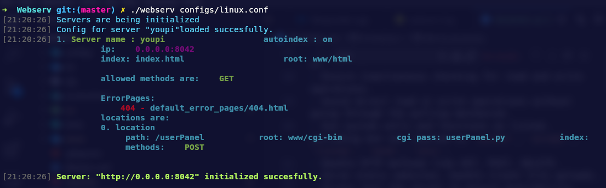
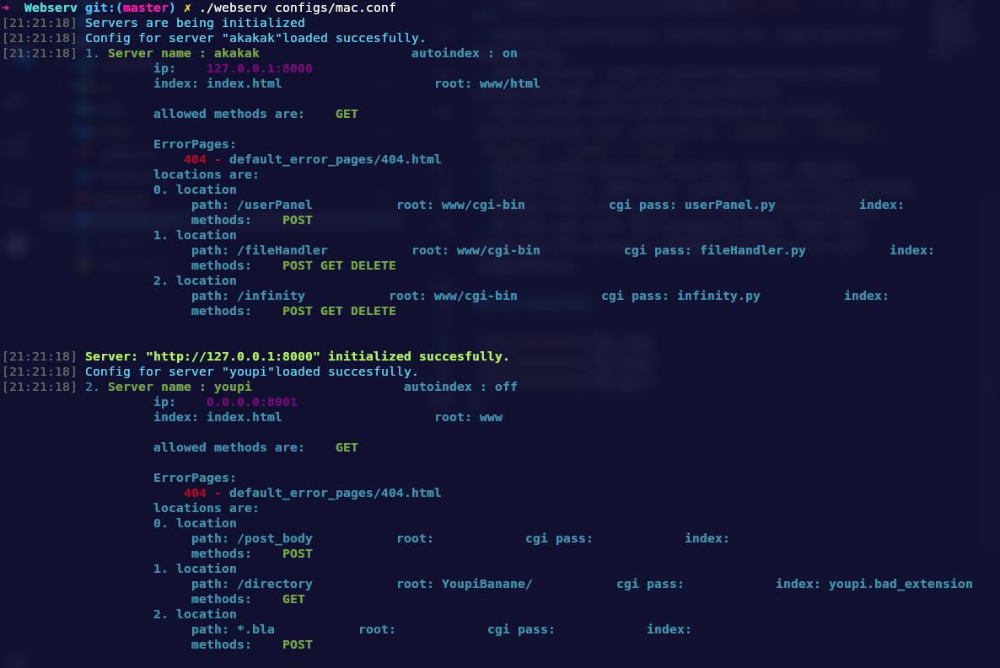
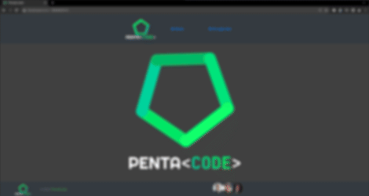
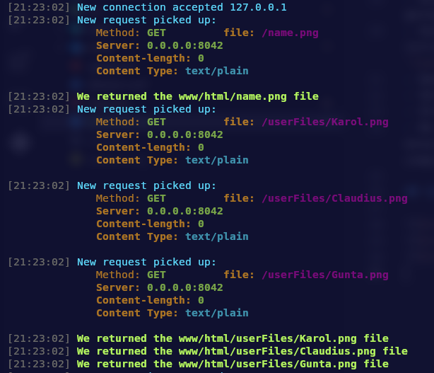
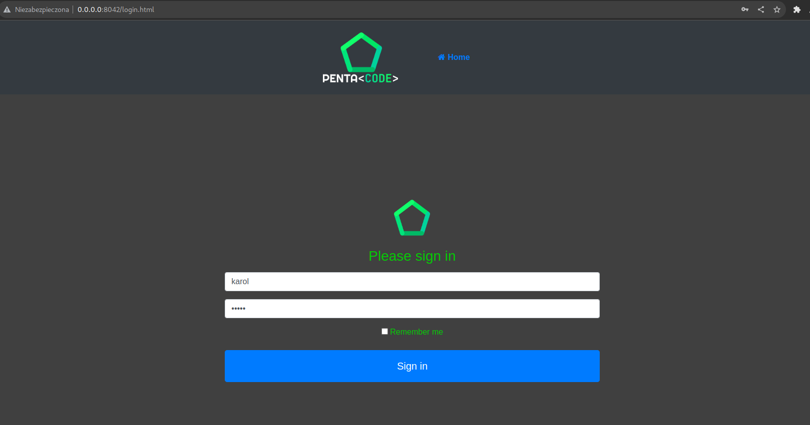
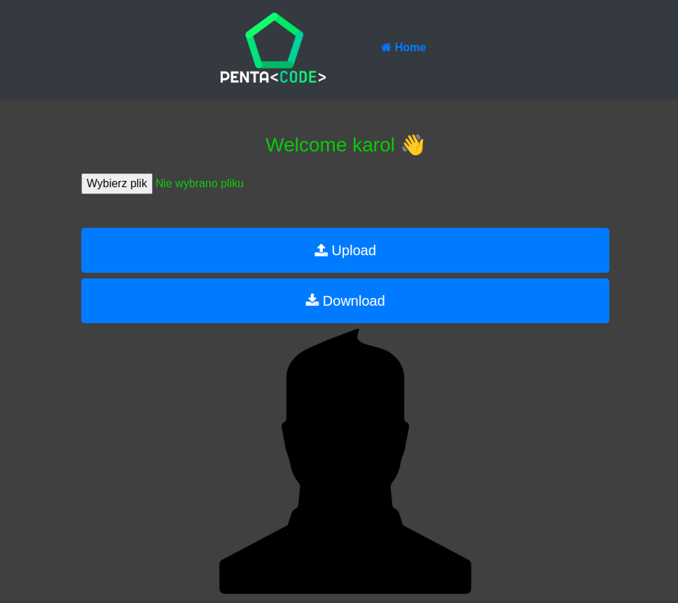
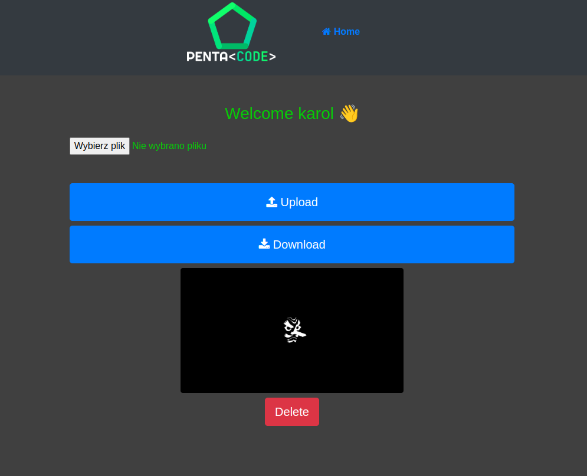
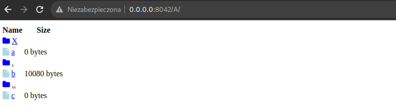

# Webserv

This project is about writing own HTTP server.

## Tehnologies

## Requirements

- Use C++ features wherever possible, preferring C++ versions of functions over C functions.
- Avoid using external libraries and specifically exclude Boost libraries.
- The server should be executable with a configuration file argument.
- Implement a non-blocking HTTP server.
- Use a single poll() or equivalent mechanism for all I/O operations.
- Ensure simultaneous checking for read and write operations.
- Avoid direct read or write operations without going through the polling mechanism.
- Use system calls and functions as listed, including but not limited to `socket`, `accept`, `listen`, `send`, `recv`.
- Handle HTTP methods like GET, POST, DELETE.
- Serve static websites, handle client file uploads.
- Stress test the server to ensure availability.
- Do not use fork for purposes other than CGI, ensuring the server's primary function is not compromised.

## Screenshots

Start of webserv:

Start of webserv with diffrent config:

Example of hosted htmls files:

Logger logging actions on page:

Login form:

Fresh user page:

User can update avatar:

Indexing:

